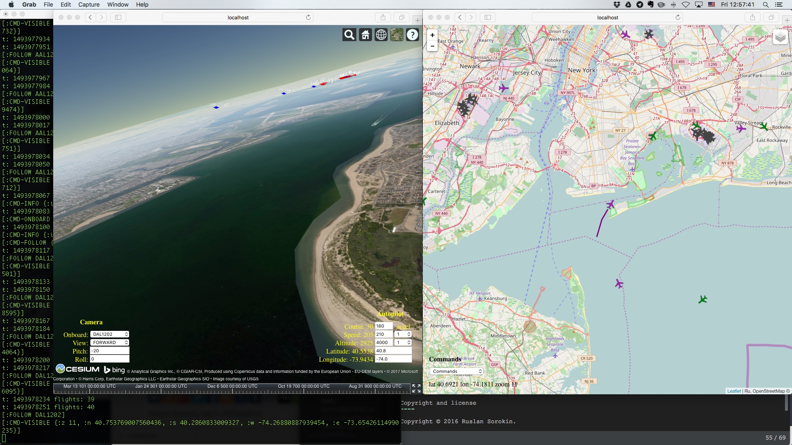

# flights-pro

Air traffic control system and flight simulator - a test example for the [rete4frames](http://github.com/rururu/rete4frames) expert system shell.
It uses [Flightradar24](http://www.flightradar24.com) web service, [Leaflet](http://leafletjs.com) JavaScript library, [Cesium](https://cesiumjs.org/) WebGL virtual globe and map engine, [geonames](http://www.geonames.org) geographical data web service and [Protege-3.5](http://protege.stanford.edu) ontology editor as server-side GUI and Clojure/ClojureScript IDE.



## Start

```clj
$ cd <..>/flights-pro
$ lein run
```
In a Protege GUI open a project FlightPro.pprj from a folder <..>/pro-projects and execute a menu item Edit -> Clojure Work.
When the Pro server starts, open two browser windows, one on the address: http://localhost:4444 (Cockpit view), second on the address: http://localhost:4444/chart (Chart view).

## Usage

### Chart view

#### Commands

In the chart view select in the "Commands" selector the item "Watch Visible Area". This begins a process of collection and display information of the flights in the visible area. Black icons means aircrafts on the ground, green ones are descending, blue ones are climbing and purple - on a level flight.

If you want to see an air traffic around some other airport, execute the command "Move to Airport", select a country and an airport in this country.

A click on the aircraft icon brings up a popup with general data of the flight and 3 buttons. The button "Trail" draws the current way of the aircraft. The button "Follow" starts moving of the visible area along this flight and periodically displays the trail of the flight. The button "Stop" ends up this moving.

You can plan your own flights. To do this, use the command "Schedule Flight". Input a call sign of your flight, a time of departure, select a country and an airport of departure and a country and an airport of arrival. That's all. When your flight starts you can follow it.

The Command "Toggle Wikipedia" starts/ends a process of search of Wikipedia articles about places of interest in the visible area. This places would be shown on the chart with the special icons and summaries of articles would be stored in Protege ontology as the instances of a class "WikiArticle". A click on the icon brings up a popup with the summary.

The command "Ask Question" gives possibility to ask Expert system different questions about environment and current situation.

The command "Clear" removes flights from the screen.

### Cockpit view

#### Camera

"Onboard" selector gives possibility to select flight to get on board, or get on board MANUAL, flight that you control yourself through "Autopilot". If you see some flight on the chart and don't see it in the "Onboard" selector, click "select" once more. This updates list of flight callsigns in sight.

Through "View" selector and "Pitch" and "Roll" fields you control direction of the camera's view.

#### Autopilot

"Autopilot" controls gives you possibility to set target values of course, speed and altitude of MANUAL flight. Values would be changing gradually. You can accelerate change of the corresponding value by "accel" selector.

Latitude and longitude values change instantly.

## Programming

You can Expert System, Clojure and ClojureScript programming and debugging in IDE based on Protege-3.5 during air traffic monitiring and simulation (see screencasts below).

## Screencasts

1. Landing of a regular Air Berlin flight in JFK airport, New-York.

    [AirBerlin Landing JFK](https://www.youtube.com/watch?v=lA3GPsUEVLE)

2. Scheduled flight simulation from Cochabamba to Santa Cruz de la Sierra, Bolivia.

    [Part 1. Takeoff](https://www.youtube.com/watch?v=HkL9MkdoSG4)

    [Part 2. Level flight](https://www.youtube.com/watch?v=1-JVObqbtcI)

    [Part 3. Continuation of the level flight](https://www.youtube.com/watch?v=hHWDM8LyrkM)

    [Part 4. Landing](https://www.youtube.com/watch?v=pzy952DoeWg)

3. Programming and debugging Expert system rules and Clojure functions:

    Adding new question to Expert System. Adding new rule to ES for answer question. Adding new function for rule's right hand side ("local-cities"). Adding second rule for answer question. Filling function's body with code. Fixing bugs using exrernal text editor ("LightTable") to locate bug places. Restarting ES. Testing new question. [Programming1](https://www.youtube.com/watch?v=bTFfXeNlGlE)


Copyright and license
----

Copyright © 2016 Ruslan Sorokin.

Licensed under the EPL (see the file epl.html).
# flights-pro
